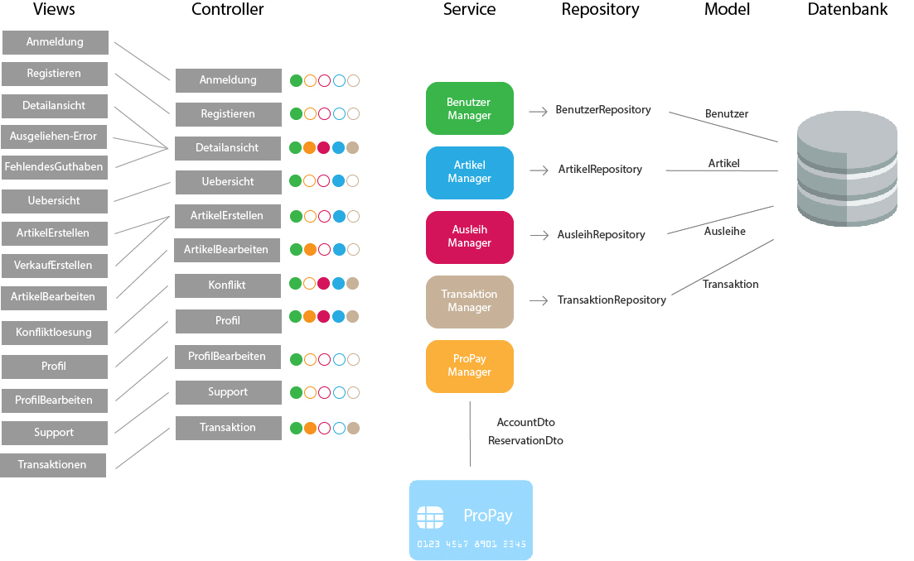

## Dokumentation

Name
^^^^^
* Elite-Verleih

Einstellungen
^^^^^^^^^^^^
* IDE: IntelliJ
* Tab/4sp: Tab
* CommitSprache: Deutsch
* DB: PostgreSQL

### Startseite und Anmeldung

Auf der Startseite haben Benutzer und der Support die Möglichkeit, sich mittels dem Benutzernamen
und einem Passwort sicher einzuloggen. Dazu wird ein Benutzername und ein Passwort benötigt.
Sind einer der Daten nicht korrekt eingegeben worden und stimmen nicht mit den Daten überein,
die in der Datenbank gespeichert worden sind, kommt eine Fehlermeldung.

Hat man bisher noch keinen Account angelegt,
so klickt man auf den Registrier-Button, wodurch man auf einer seperaten Seite einen neuen Benutzer anlegen kann.
Der Login mit dem Username "support" führt direkt zur Konfliktlöseseite.

##### Registrieren

Um einen neuen Benutzer anzulegen, muss der User einen Benutzernamen eingeben, der
noch nicht vergeben sein darf. Zudem wird eine Emailadresse benötigt und ein beliebiges Passwort.

Falls der User einen bereits vergebenen Benutzernamen eingibt, kommt eine Fehlermeldung,
dass dieser Name bereits vergeben ist und der Account wird nicht angelegt. Analog dazu
muss die Emailadresse gültig und ein beliebiges Passwort eingegeben sein.

##### Erfolgreiches Einloggen als Benutzer

##### Navbar
Nach einem erfolgreichem Login wird der Benutzer sicher auf die Übersichtsseite
weitergeleitet.
Von hier aus besitzt jede Seite eine Navbar, in der der Benutzer sich oben links
mit dem Logo von Elite-Verleih auf die Übersichtsseite gelangen kann. Auf der rechten
Seite kann der Benutzer mittels einem Dropdown-Button auf die Profilseite kommen und sich
ausloggen. Die Navbar hat je nach Seite noch weitere Funktionen, die später erläutert werden.

### Übersicht

In der Navbar der Übersichtsseite kann der Benutzer außerdem nach Artikeln suchen,
indem er einen Teil, oder den vollständigen Namen eines Artikels eingibt.
Außerdem befinden sich auf der rechten Seite Button, mit der man Artikel zum verkaufen
oder zum verleihen anlegen kann.

In der Übersicht werden alle Artikel aufgelistet, die von verschiendenen Benutzern angelegt wurden. Bilder, Name des Artikels
und Kosten pro Tag verschaffen dem Nutzer einen leichten Überblick.
Der Benutzer kann auf einen Artikel klicken, wodurch er auf die Detaillseite des
Artikels gelangt.

### Artikel erstellen
Als Benutzer hat man die Möglichkeit einen eigenen Artikel einzustellen. Hierzu
werden folgende Attribute benoetigt:

* Name
* eine kurze Beschreibung des Artikels
* eine Kaution, als Zahl in Euro
* einen Tarif pro Tag, ebenfalls als Zahl in Euro
* einen Abholort
* eine URL zu einem Referenzbild

Zum Einstellen des Artikels werden alle Angaben benötigt. Man kann dann entweder
mit dem Button "Submit" den Artikel über das ArtikelRepository an die Datenbank senden,
sodass er ab dann in der Übersicht sichtbar ist. Gibt der Benutzer einen negativen Wert für eine Ausleihe oder eine Kaution an,
so wird eine Fehlermeldung ausgegeben, dass der Wert mindestens 1 betragen muss.
Zum anderen hat man die Option das Formular zu resetten, also alle Eingaben wieder
zu löschen.

### Artikel bearbeiten
Diese Seite kann nur von dem jeweiligen Besitzer des Artikels erreicht werden.
Hierdurch sollen unbefugte Änderungen abgefangen werden.
Die Funktion einen Artikel zu bearbeiten funktioniert analog zu dem Anlegen eines
neuen Artikels. Es werden hier die Werte, die der Artikel aktuell besitzt in den
Eingabefeldern angezeigt, so können sie leichter wieder übernommen oder abgeändert
werden. Es werden die Attribute nach absenden des Formulars neu gesetzt und dann
über das ArtikelRepository neu in der Datenbank abgespeichert.

Zusätzlich kann hier
noch der Artikel entfernt oder bearbeitet werden, falls keine Ausleihen für ihn bestehen. Kann
der Artikel erfolgreich gelöscht werden, so wird auf die aktualisierte
Übersichtsseite weitergeleitet, ist das Löschen nicht möglich, so wird ein Fehler
auf der Bearbeiten-Seite angezeigt.

### Detailansicht
In der Detailansicht kann man sich alle Angaben zu einem Artikel anschauen. Des
Weiteren kann hier eine Ausleihe für einen Artikel erstellt werden. Hier
werden wieder die folgenden Attribute angezeigt:

* Name des Artikels
* eine Beschreibung
* der Besitzer des Artikels, mittels Benutzername
* die Kaution
* der Tarif pro Tag
* der Ort, an dem der Artikel abgeholt werden soll
* falls keine Ausleihen bestehen, wird angezeigt, dass der Artikel verfügbar ist
* eine Liste mit den Daten, an denen der Artikel bereits ausgeliehen ist

Außerdem kann hier über zwei Datumsfelder eine Ausleihe erstellt werden. Klickt
man auf die Felder für die Datumseingabe öffnet sich (in fast allen Browsern)
ein Kalender in dem die Daten durch klicken ausgewählt werden können und somit
auch automatisch formatiert werden. Liegt das eingegebene Datum in der Vergangenheit, geht die Anfrage an den Verleihern, der diese
auch bestätigen kann. Bei Bestätigung der Anfrage wird diese aber automatisch abgelehnt.
Das zweite angegebene Datum "bis", muss einen späteren Zeitpunkt als
das erste angegebene Datum haben. Es kommt ansonsten dazu eine Fehlermeldung.

Darunter befindet sich der Button "Artikel
ausleihen", der mittel der eingegebenen Daten eine Ausleihe mit dem Besitzer und
dem aktuellen Benutzer erstellt. Falls der Artikel dem aktiven Benutzer gehört,
existiert dieser Button nicht und der Artikel kann nur bearbeitet werden.
Wurde eine Ausleihe erfolgreich bestellt, kann der Benutzer in der Artkelbeschreibung sehen,
wann verschiedene Ausleihen bestehen. Das Datum ist dann geblockt.

Ist während der angefragten Daten schon eine
Ausleihe erstellt worden, so wird man auf eine Seite weitergeleitet, wo der
Benutzer darüber in Kenntnis gesetzt wird, dass der Artikel zu diesen Daten
leider nicht mehr verfügbar ist.

Außerdem wird bei dem Erstellen einer Ausleihe überprüft, ob der Benutzer noch
genug Guthaben hat um die Kaution zu decken. Ist dies nicht der Fall, so wird der
Benutzer auf eine Fehlerseite weitergeleitet.
Besitzt der Besitzer genug Guthaben,wird die Ausleihe-Anfrage weitergeleitet.
Wird diese angenommen, wird die Kaution des Artikels reserviert.

In dem Fall, dass erfolgreich eine Ausleihe erstellt werden konnte, wird der
Benutzer einfach zurück auf die Übersichtsseite geleitet.
Ist man Besitzer dieses Artikels hat man außerdem noch über einen Button
die Möglichkeit den Artikel zu bearbeiten.

* *Error: Artikel nicht verfügbar*
Der Benutzer wird darüber informiert, dass zu seinen angefragten Daten der
Artikel leider nicht mehr verfügbar ist. Außerdem gibt es einen Button "Zurück
zur Übersicht" womit der Benutzer wieder auf die Übersichtsseite navigieren kann.

* *Error: Fehlendes Guthaben*
Sollte der Benutzer für eine Aktion nicht ausreichend Guthaben besitzen, so wird
er auf diese Seite weitergeleitet. Hier wird er über den Umstand in Kenntnis
gesetzt außerdem wird die Möglichkeit geboten über einen Button "Konto aufladen"
die Profil-bearbeiten-Seite aufzurufen, wo der Benutzer sein Guthaben aufladen
kann.
Zudem wird hier die E-Mail zum Kontaktieren des Supports angezeigt.

### Profil

Übersicht -> Benutzername, Mein Profil

In der Navbar hat der Benutzer eine zusätzliche Anzeige, wie viel Guthaben sich auf seinem
ProPay-Konto befindet.
Zudem gelangt der Nutzer nun auch durch das Dropdown-Menü auf der rechten Seite zur
Profil-Bearbeiten Seite und hat die Möglichkeit sich auszuloggen.

##### Profil bearbeiten
Übersicht -> Benutzername, mein Profil -> Benutzername, Profil bearbeiten
- Der Benutzer kann hier seine Email Adresse ändern und bei Bedarf sein Guthaben aufladen.

Der Benutzer findet auf der Profilseite alle für ihn laufenden Prozesse von Artikeln.
Dabei lassen sich die Prozesse in folgende Abschnitte unterteilen: Anfragen, Ausgeliehenes,
eigene Artikel, zurückgegebene Artikel und Konflikte.

##### Anfragen

Alle angefragten Artikel von anderen Nutzern werden hier angezeigt. Der Benutzer kann entscheiden,
welche Artikel er annehmen, oder ablehnen möchte.

- Lehnt der Benutzer eine Anfrage ab, so wird die Liste direkt aktualisiert und die
Anfrage wird nicht mehr angezeigt. Der Status einer Anfrage ändert sich von _angefragt_
zu _abgelehnt_.

- Wird eine Anfrage angenommen, zu dem im selben Ausleihzeitraum andere Anfragen existieren,
werden die anderen Anfragen automatisch abgelehnt. Somit werden duplizierte Ausleihen
vermieden. Es wird über ProPay eine Kaution für die Ausleihe erstellt. Falls
die Kaution nicht auf dem Konto vorhanden ist oder ein Fehler auftritt, wird die
Anfrage abgelehnt.

- Bei erfolgreicher Bestätigung einer Anfrage wird der Status von _angefragt_ auf _bestaetigt_ verändert
und erscheint beim verleihenden Nutzer unter Eigene Artikel -> Verliehenes, wenn der
Zeitraum aktiv ist.

- Liegt eine Anfrage in der Vergangenheit, wird diese automatisch gelöscht, unabhängig davon ob man _bestaetigen_ oder
_ablehnen_ auswählt. Der Ausleihende bekommt auch hier die Benachrichtigung, dass seine Ausleihe abgelehnt wurde.

##### Ausgeliehenes

Wird ein angefragter Artikel vom Besitzer bestätigt und der Ausleihezeitraum ist
aktiv, so wird dieser in der Spalte *Aktiv*
angezeigt.

- Der Ausleiher kann den Artikel zurückgeben, wenn der Ausleihezeitraum zuende ist und
auf dies auf dem Button *Zurückgeben* bestätigen. In diesem Schritt werden die Kosten
des Ausleihzeitraums berechnet und dem Verleiher überwiesen. Ist nicht genügend Geld
auf dem ProPay-Konto des Ausleihers vorhanden, wird eine Fehlermeldung angezeigt, dass
nicht genügend Geld auf dem Konto vorhanden ist. Der Ausleiher wird dazu aufgefordert,
sein Geld auf dem Konto aufzuladen.
Der Ausleiher hat außerdem die Möglichkeit, den Artikel bereits vorzeitig abzugeben.

Angefragte Artikel werden in der Spalte *Wartend* angezeigt. Der Benutzer hat die Option,
die Anfrage vorzeitig zurückziehen. Damit wird die Ausleihe gelöscht. Wird der angefragte Artikel in demselben Zeitraum
von einer anderen Person ausgeliehen, wird die Anfrage der aktuellen Person in _abgelehnt_ geschoben.

##### Eigene Artikel

Eigene aktiv verliehene Artikel werden in der Spalte *Verliehenes* angezeigt. Diese Liste
wird gefüllt, wenn der Benutzer zuvor eine Anfrage bestätigt hat.

- Kommt es zu einem Konflikt, wie Beispielsweise die verspätete Abgabe eines Artikels,
so kann der Benutzer dieses Problem an die Konfliktlösestelle schicken. Der Status der
Ausleihe wird somit auf _konflikt_ gesetzt.

In der Spalte *Angebotene* werden alle angebotenen Artikel angezeigt.
- Wenn der Artikel weder ausgeliehen noch verkauft ist, besteht hier ebenfalls die Möglichkeit, den Artikel zu bearbeiten
oder zu löschen.

Wird ein verliehener Artikel zurückgegeben, so erscheint dieser in der Spalte *Zurückerhaltenes*.
Falls ein verliehender Artikel zurückgegeben wird bevor der Ausleihzeitraum beginnt, werden keinerlei Kosten dem Ausleihenden
berechnet.

- Falls der Artikel nicht den gewünschten Zustand hat, so kann der Benutzer ein Problem
an den Support schicken. Dort wird entschieden, wer die Kaution erhält.
- Falls der Artikel einwandfrei zurückgegeben wurde, kann der Prozess mittels mit dem Button *Akzeptieren*
beendet werden. Die Kaution des Ausleihers wird wieder freigegeben.

##### Zurückgegebene Artikel

Artikel, die der Benutzer selbst ausgeliehen hat und bereits an den Verleiher
zurückgegeben hat, werden in *Ausstehende* aufgelistet. Der Benutzer wartet auf die Bestätigung des
Verleihers, dass der Artikel in Ordnung ist.
Reagiert der Verleihende nicht auf die ausstehende Rückgabe, kann auch der Ausleihende in seinem Profil die Ausleihe dem Support melden.

Wurde vom Verleiher bestätigt, dass der Artikel in Ordnung ist, so werden in der Spalte *Erfolgreich* die
erfolgreich zurückgegebenen Artikel angezeigt. Die Kaution wird an den Ausleihenden überwiesen.

Der Nutzer kann nun auf den Button "Entfernen" klicken und somit den Vorgang endültig beenden.
Die Ausleihe wird daraufhin gelöscht und somit aus der Datenbank entfernt.

##### Konflikte

Hier werden noch nicht gelöste Konflikte aufgelistet. Konflikte können nicht vom Benutzer selbst
aufgelöst werden, er kann lediglich seine Wünsche / Probleme via Email mit dem Support klären,
welcher dann entscheidet, wer die Kaution des Artikels erhält.

- Konflikte werden dem Support auf der Konfliktlöseseite angezeigt, hier kann er die Kaution dem Ausleihenden / Verleihenden buchen und damit den Konflikt beenden.
 Außerdem werden zu jedem Konflikt auch die Daten der involvierten Benutzer angezeigt.

### Anmeldung als Support

Der Support meldet sich wie jeder andere Nutzer über die Login-Seite an.
Es gibt einen festen Account *support*, der mit dem Passwort *1* verbunden ist.
Die Ansicht des Supports ist eine Liste von Konflikten, die von Benutzern an die
Konfliktstelle gesendet wurden. Der Support kann auf keine andere Seite zugreifen.

Der Support hat folgende Funktionen:

* Kaution an Verleiher buchen (Gegenstand war defekt)
* Kaution an Ausleiher buchen

Mit beiden Aktionen wird der Ausleihstatus auf *beendet* geändert.

# Softwarearchitektur

Die ersten Schritte in unserem Team waren es, die Sturktur unseres Projektes
festzulegen:

Die *Views* ermöglichen die graphische Repräsentation der Daten. Die einzelnen Views
wurden bereits in vorherigen Kapiteln ausgiebig erläutert.

Die *Controller* ermöglichen die Umsetzung von Benutzeranforderungen. Je nach View sind diese
mit den entsprechenden Controllern verbunden, wie die oben dargestellt Graphik darstellt.
Um die Logik von den Controllern zu separieren und eine gut strukturierte Architektur zu
ermöglichen, gibt es mehrere *Services*. In diesen Services befinden sich Logik, um
verschiedene Funktionen in der Webanwendung zu ermöglichen. Jeder Controller greift auf einen,
oder mehrere Services zu, wie in der Graphik mittels verschiedenen Farben deutlich gemacht wird.

Für die Verwendung einer *Datenbank*, werden zudem verschiedene Repositorys sowie Models
benötigt, damit diese mit den entsprechenden Daten gefüllt werden kann. In unserem Team haben
wir uns einheitlich für eine PostgreSQL-Datenbank entschieden.

Die Verbindung mit *ProPay* und Elite-Verleih wird ebenfalls durch eine eigene
Serviceklasse sichergestellt. Durch den ProPayManager werden dem Programmierer mehrere Methoden
zur Verfügung gestellt, womit jedem Benutzer ein Konto zur Verfügung gestellt wird und dazu die
entsprechenden Services.

Diese Architektur hat uns vor allem ermöglicht, in großen Teilen unabhängig voneinander
entwickeln zu können. Somit fiel es uns leicht, Aufgaben zu verteilen und später
weitere Details und Funktionen zusammenzuführen.

### Tests

Neben dem Testen der Anwendung selbst im Browser, gibt es einige Fälle, die wir so nicht testen können,
beispielsweise mit Szenarien in der Zukunft.

Daher sind Tests zu den verschiedenen Managern absolut notwendig. Unser Team hat daher
sichergestellt, dass verschiedene Szenarien auf Richtigkeit geprüft worden sind.

### Spring Security

Für die Authentisierung, Authentifizierung und Autorisierung auf den Seiten wurde
Spring Security eingeführt. Die SecurityConfig legt bestimmte Rollen fest,
in unserem Fall ADMIN - der auf alle Seiten zugreifen darf, SUPPORT - der nur auf 
die Konfliktlöseseite gelangt nach dem Login und USER, hiervon können beliebig 
viele Accounts erstellt werden, sie dürfen dann auf alle Seiten außer der 
Konfliktlöseseite zugreifen. Besitzt jemand keine Rolle, ist also nicht 
eingeloggt, so darf nur die Login- und die Registrierungs-Seite aufgerufen werden. 
Bei der Registrierung wird ein neuer Benutzer erstellt und in der Datenbank
gespeichert, die Rolle USER wird automatisch gesetzt. In dieser Rolle darf auf 
alle Seiten außer der Konfliktlöseseite zugegriffen werden, der Benutzer kann 
sich ab dann über das Login-Formular authentifizieren. 
Des Weiteren wird MyUserDetails als Hilfsklasse verwendet, um die Authentifizierung
über das BenutzerRepository zu machen, was bedeutet, dass jeder Benutzer auch einen 
Account bei der Anwendung besitzt. Dies wird in SecurityConfig-Methode config 
konfiguriert. 

# Hinzufügen der Verkaufen-Funktion

## 1. Grundlegendes Konzept überlegen:

Im Modell des Artikels soll es folgende anpassungen geben:

* _boolean_ zuVerkaufen, der angibt ob Artikel verkauft werden soll
* _int_ artikelPreis, für den Artikel bei Verkauf

Die Controller und Views müssen wie folt angepasst werden:

* neue View für *VerkaufErstellen*, jedoch im Controller von ArtikelErstellen
handhaben mit Get- und PostMapping zu "/VerkaufErstellen"
* *ArtikelBearbeiten* soll so abgeändert werden, dass wenn der Artikel zum Verkauf
steht statt Kaution und Tarif nur der Preis geändert werden kann
* In der *Detailansicht* soll auch statt Kaution und Tarif nur der Verkaufspreis
angezeigt werden, es soll die Möglichkeit geben den Artikel zu kaufen (genauer:
Überweisen des Verkaufspreises vom aktuellen Benutzer zu dem Besitzer und dann
löschen des Artikels aus der Datenbank), außerdem soll es nicht mehr die
Möglichkeit geben den Artikel auszuleihen
* In der *Übersicht* soll angezeigt werden ob ein Artikel verkauft oder verliehen
wird, des Weiteren soll statt dem Tarif der Verkaufspreis angezeigt werden, zu
Guter letzt soll es zwei Buttonsgeben um einen Verleih und einen Verkauf zu
erstellen

Es soll nicht die Möglichkeit geben einen Artikel der zum Verleih angeboten wird
später zum Verkauf anzubieten, umgekehrt gleichermaßen. Ein Artikel zum Verleih
bleibt also immer nur zu verleihen und kann nur durch löschen und Neueinstellung
des Artikels zum Verkauf verkauft werden.

## 2. Umsetzung

Zuerst wurde die VerkaufErstellen View erstellt, der Controller von ArtikelErstellen
wurde angepasst, zudem musste dem artikelManager eine zweite Methode erstelleVerkauf
hinzugefügt werden, die den zuVerkaufen-boolean auf true setzt. Dieser Wert soll
*niemals* geändert werden. Außerdem werden hier Kaution und Tarif auf Null
gesetzt, was ebenfalls für den User nicht manipulierbar sein sollte. Zuletzt wird
dem artikelPreis der vom Benutzer eingegebene Preis zugewiesen.

Die Methode erstelleArtikel wurde umbenannt zu erstelleVerleih. auch hier wird
der boolean gesetzt, in diesem Fall auf false, und soll *unter keinen Umständen*
geändert werden können. Hier wird der Preis auf Null gesetzt, auch diese Wert
soll für den Benutzer final sein.

Die Änderungen für ArtikelBearbeiten waren minimal, da nur abgefragt werden
musste ob der Artikel zum Verkauf steht oder verliehen werden soll, um dann
Preis oder Kaution und Tarif anzuzeigen. Artikel löschen funktioniert für diese
zu verkaufenden Artikel immer, da sie keine Ausleihen haben, analog zu den zu
Verleihenden.

In der Detailansicht wurde der Kalender entfernt, falls der Artikel zum Verkauf
steht, und ein "Artikel kaufen" button hinzugefügt. Hierzu wurde im Controller
eine Methode mit Mapping auf "/Kaufen/{artikelId}" erstellt, welche versucht den
Artikelpreis vom aktuellen Benutzer zu dem Artikelbesitzer zu überweisen. Gelingt
dies, so wird der Artikel gelöscht und der Benutzer zur Übersicht weitergeleitet.
Ansonsten erhält er eine Fehlermeldung. Es wird hier geprüftt, dass der Benutzer
nicht seine eigenen Artikel kaufen kann.

Zuletzt wurde in der Detailansicht ein Feld hinzugefügt, welches angibt ob ein
Artikel verkauft oder verliehen werden soll. Auch hier wurde für die zu verkaufenden
Artikel der Preis statt dem Tarif angezeigt, dies ist durch eine simple Abfrage
des zuVerkaufen-boolean möglich.
Außerdem wurde ein weiterer Button hinzugefügt, der auf die VerkaufErstellen Seite
leitet. Diese Buttons zum Erstellen eines zu verleihenden oder zu verkaufenden
Artikels wurden der Übersichtlichkeits halber in die Navbar eingebettet.
